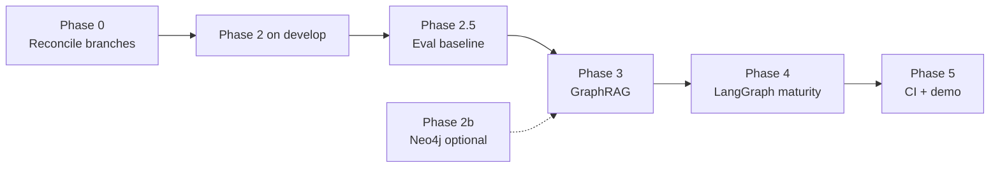

# VPP RAG Agent — Updated Roadmap

Last updated: June 2025 · Branch: `develop`

---

## Current state

| Area | Status | Where |
|------|--------|-------|
| LangGraph agent + ENTSO-E API + Chroma RAG | ✅ Done | `develop` |
| LangChain tools, retriever/LCEL, structured routing (Phase 1) | ✅ Done | `develop` (#2) |
| NetworkX knowledge graph + `GraphStore` (Phase 2) | ✅ Done | `main` only (#3) |
| Eval baseline (Phase 2.5) | ✅ This branch | `src/eval/`, `vpp-rag eval run` |
| GraphRAG hybrid retrieval (Phase 3) | ❌ Not started | — |
| LangGraph maturity (Phase 4) | ❌ Not started | — |
| CI eval + demo (Phase 5) | ❌ Not started | — |
| LangSmith | ❌ Out of scope | Removed from plan |

**Branch note:** `develop` has Phase 1 but not the graph layer. `main` has the graph layer but is missing Phase 1. Reconcile before new feature work (see Phase 0).

---

## Phase map

```
Phase 0   → reconcile develop + main
Phase 1   → LangChain idioms                    ✅ develop
Phase 2   → NetworkX knowledge graph            ✅ main (port to develop)
Phase 2.5 → local eval baseline                 ✅ this branch
Phase 3   → GraphRAG (hybrid + entity + communities)
Phase 4   → LangGraph maturity (memory, streaming, ReAct)
Phase 5   → CI eval gate + hosted demo
Phase 2b  → optional Neo4j GraphStore backend   (only if needed)
```



---

## Phase 0 — Reconcile `develop` and `main`

**Goal:** One integration branch with Phase 1 + Phase 2 before adding eval.

**Actions:**
1. Merge `develop` → `main` (or merge `main` → `develop` and make `develop` canonical).
2. Resolve conflicts in `agent.py`, `tools.py`, `index_commands.py`.
3. Run full test suite + `pre-commit`.
4. Delete stale remote feature branches if any remain.

**Done when:** `develop` contains graph store, graph ingest, `vpp-rag graph query`, and LangChain Phase 1 work.

**Effort:** ~1–2 hrs.

---

## Phase 1 — LangChain idioms ✅ Done

**On `develop` today.**

| Deliverable | Location |
|-------------|----------|
| `@tool` wrappers | `src/service/tools.py` |
| Retriever + LCEL | `src/service/rag.py` |
| Structured `QueryClassification` | `src/service/agent.py` |
| Service tests | `tests/service/` |

**Contribution:** Smarter query routing, idiomatic LangChain, testable tools — foundation for ReAct (Phase 4) and eval (Phase 2.5).

---

## Phase 2 — Regulation knowledge graph ✅ Done (port to `develop`)

**Merged to `main` via PR #3. Needs to land on `develop` (Phase 0).**

| Deliverable | Location |
|-------------|----------|
| `GraphStore` protocol | `src/service/graph_store.py` |
| `NetworkXGraphStore` + GraphML | `.graph_db/regulations.graphml` |
| Graph ingest (heuristic + optional `--use-llm`) | `src/service/graph_ingest.py` |
| Graph search in agent | `src/service/graph_search.py` |
| CLI | `vpp-rag index --with-graph`, `vpp-rag graph query` |

**Contribution:** Relational regulation answers, entity-linked context, zero extra infra (no Docker).

**Optional Phase 2b — Neo4j:** Same `GraphStore` interface, `Neo4jGraphStore` + docker profile. Only for roles requiring graph DB experience or scale beyond in-memory.

---

## Phase 2.5 — Eval baseline ⏳ Next

**Goal:** Numerical baseline for every future phase. No LangSmith — fully local.

### Impact
Converts "I built RAG" into measurable recall@k, MRR, context precision, faithfulness, and p95 latency. Phase 3 deltas become a table, not a narrative.

### Technology
- Custom metrics (no RAGAS).
- `ChatOllama` + `FaithfulnessJudgment` structured output for optional faithfulness scoring.
- Markdown report at `docs/eval_report.md`.

### Architecture
```
src/eval/
  dataset.py      # EvalCase, load_eval_set()
  metrics.py      # recall_at_k, mrr, context_precision, LLMJudge
  runner.py       # run_eval() over real retriever + VppAgent
  report.py       # render_markdown(), write_report()

src/cmd/eval_commands.py
  vpp-rag eval run [--k 4] [--no-judge] [--retrieval-only]

tests/eval/regulation_eval_set.jsonl   # hand-curated 35+ cases (not LLM-synthesized)
tests/eval/test_metrics.py
```

### EvalCase schema
```json
{
  "id": "reg-001",
  "question": "What are the FCR requirements?",
  "expected_doc_substrings": ["fcr", "frequency"],
  "expected_pages": [],
  "answer_must_contain": ["FCR"],
  "category": "balancing"
}
```

### Done criteria
- `uv run vpp-rag eval run` → Rich summary table + `docs/eval_report.md`
- Baseline row: `baseline-vector | k=4 | recall | mrr | ctx_prec | faith | p95`

### Effort
~8–10 hrs (already prototyped on deleted branch `d9591af` — can cherry-pick or re-implement).

### Contribution by dimension

| Dimension | What improves |
|-----------|---------------|
| UX | Indirect — fewer regressions in later phases |
| Inference | Faithfulness judge catches hallucination vs context |
| Portfolio | Interview-grade numbers |
| Architecture | Gold set + runner reused in Phases 3–5 |

---

## Phase 3 — GraphRAG

**Goal:** Measurable retrieval lift vs Phase 2.5 baseline. Three sub-phases.

### 3a — Hybrid retriever
- `rank_bm25` + Reciprocal Rank Fusion with Chroma retriever.
- `HybridRetriever` in `src/service/hybrid_retriever.py`.
- BM25 corpus in `.chroma_db/bm25_corpus.pkl`, rebuilt with vector index.
- Env: `VPP_RETRIEVER=hybrid|vector`.

### 3b — Entity-linked chunks
- Store matched graph entities in Chroma metadata at index time.
- `EntityFilteredRetriever` boosts chunks overlapping query entities.

### 3c — Communities + multi-hop
- `networkx.community.louvain_communities` + cached LLM summaries.
- `get_multi_hop_context()` in `graph_search.py`.
- Agent merges: RRF hits + entity chunks + community summaries.

**Done when:** `docs/eval_report.md` shows 4 rows (vector → hybrid → entity → graph) with monotonic recall improvement.

**Effort:** ~15–20 hrs.

---

## Phase 4 — LangGraph maturity

**Goal:** Conversational, streaming, resilient agent.

| Feature | Deliverable |
|---------|-------------|
| Checkpointing | `SqliteSaver`, multi-turn CLI (`--thread`) |
| Streaming | `graph.astream_events`, Rich live output |
| Subgraphs | `price_subgraph`, `regulation_subgraph` |
| ReAct | `create_react_agent` for tool loop |
| Error recovery | Retry ENTSO-E, degraded answer path |
| E2E tests | `tests/e2e/` with `respx` mocks |

**Eval hook:** `--multiturn` flag on eval runner; follow-up cases in gold set.

**Effort:** ~18–24 hrs.

---

## Phase 5 — CI eval gate + demo

**Goal:** PR eval comments + hosted demo. No LangSmith.

| Deliverable | Details |
|-------------|---------|
| `src/eval/diff.py` | Compare baseline vs candidate `EvalReport` |
| `vpp-rag eval diff` | CLI for local and CI use |
| `.github/workflows/eval.yml` | Run eval on PRs touching `src/service/` or `src/eval/` |
| PR comment | Post metric diff table vs `develop` |
| `src/api/app.py` | FastAPI SSE `/ask` |
| `apps/streamlit_app.py` | Chat UI with streaming |
| Fly.io deploy | Optional hosted demo |

**CI policy:** Informational initially — flag regressions, don't block merges.

**Effort:** ~12–16 hrs.

---

## Phase contributions summary

| | UX | Smarter inference | Measurable |
|---|-----|-------------------|------------|
| **1** | Better routing | Structured classify | — |
| **2** | Relational reg answers | Graph neighbors in context | — |
| **2.5** | — | Faithfulness judge | **Baseline metrics** |
| **3** | Hard-query quality | Hybrid + multi-hop | Recall/faith deltas |
| **4** | Multi-turn, streaming | ReAct tool loop | Multiturn eval cases |
| **5** | Hosted demo | — | CI regression diffs |

---

## Priority order

| Priority | Work | Effort | Depends on |
|----------|------|--------|------------|
| P0 | Reconcile `develop` + `main` | 1–2 h | — |
| P0 | Re-land Phase 2.5 eval baseline | 8–10 h | Phase 0 |
| P1 | Phase 3a hybrid retriever + eval delta | 5 h | 2.5 |
| P1 | Phase 3b entity-linked chunks | 5 h | 3a |
| P2 | Phase 3c communities + multi-hop | 8 h | 3b |
| P2 | README refresh #1 (eval table) | 3 h | 3a |
| P3 | Phase 4 checkpointing + streaming | 10 h | 3 |
| P3 | Phase 4 ReAct + E2E | 10 h | 4 partial |
| P4 | Phase 5 CI workflow + eval diff | 6 h | 2.5 |
| P4 | Phase 5 demo (FastAPI + Streamlit) | 10 h | 4 |
| — | Phase 2b Neo4j (optional) | 8 h | 2 |

---

## Minimum viable portfolio snapshot

**Phases 0 + 2.5 + 3 + README refresh ≈ 35 hrs**

Delivers:
- LangGraph + LangChain agent on ENTSO-E domain
- Vector + graph + hybrid GraphRAG
- Hand-curated eval set with before/after numbers
- No external observability dependency

Phases 4–5 compound the story (conversational agent, CI gate, live demo) but are not required for a strong GitHub + interview narrative.

---

## Explicitly out of scope

- LangSmith / external tracing platforms
- RAGAS (too heavy for 35-case gold set)
- Price forecasting models (day-ahead fetch only)
- Neo4j by default (NetworkX + GraphML is the default graph backend)
- LLM-synthesized eval datasets

---

## Suggested branch names (when implementing)

| Phase | Branch |
|-------|--------|
| 0 | `chore/reconcile-develop-main` |
| 2.5 | `feature/rag-eval-baseline` |
| 3a | `feature/hybrid-retriever-bm25` |
| 3b | `feature/entity-linked-chunks` |
| 3c | `feature/graph-communities-multihop` |
| 4 | `feature/langgraph-streaming-checkpoints` |
| 5 | `feature/ci-eval-and-demo` |
